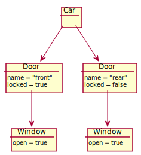

[]( https://g.codefresh.io/pipelines/kubik/builds?repoOwner=kubevious&repoName=kubik&serviceName=kubevious%252Fkubik&filter=trigger:build~Build;branch:master;pipeline:5eb9eb74d794435ece16cc56~kubik)

# Kubik

**Kubik** (pronounced [ku:bik]) is a domain-specific language define validation rules
over configuration graphs. Kubik uses JavaScript-like syntax that allows any arbitrary rules
to be easily be written and read.

## Why use Kubik?

Configurations that have tree or graph structure are not easy to navigate and validate for correctness. Some examples are cloud environments, networking, Kubernetes, etc. 

Kubik enables traversal and validation of nodes using a combination of declarative and imperative rules.

## The Basics

Kubik rule consists of two parts: target and rule scripts. Target script declares on which nodes should the validation be executed. Rule script validates each node that matches the target script.

Lets consider following example. We have a graph representation of a Car that has front and rear Doors, each of those have a Window. 



### Case 1. All doors locked.
Lets ensure that all doors are locked, before we can drive the car. 

**Target:**
```js
select('Door')
```
**Rule:**
```js
if (!item.props.locked) {
    error()
}
```

### Case 2. Rear windows closed.
We want to make sure that only the rear window is closed.

**Target:**
```js
select('Door')
    .name('rear')
.child('Window')
```
**Rule:**
```js
if (!item.props.closed) {
    error()
}
```

## Graph Representation
Each node in the graph has a **type** and **name**. In the example above the type can be *"Door"* and *"Window"* and the names are *"front"* and *"rear"*. Nodes can also be marked using value labels.

Multiple sets of key-value or array objects can also be associated with each node.

## Target Script Specification
The target script starts with **select** statement that takes the node **type** as an input. That statement would select all nodes of the given type.
```js
select('Door')
```

Nodes can be traversed further by going down one level using **child**.
```js
select('Door')
.child('Window')
```


For further capabilities, lets consider bit more complex example:

